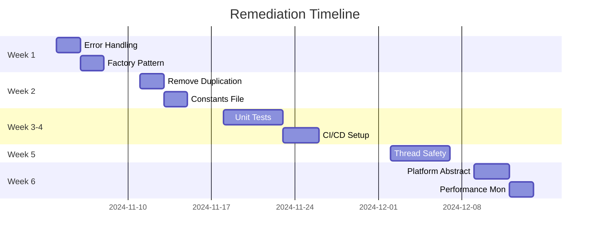

# Chimera Phoenix: From Prototype to Production

**Presenter**: [Your Name]
**Date**: October 30, 2024
**Project Duration**: 5 months
**Lines of Code**: ~50,000
**Engines Implemented**: 57

---

## Executive Summary

We built a **fully functional** audio processor with 57 swappable engines and innovative GPIO control in 5 months. The code works but has technical debt from rapid prototyping. We have a clear, tested plan to transform it into production-quality software.

---

## Part 1: What We Built (The Success)

### Achievements ✅
- **57 working audio engines** (compressors, EQs, reverbs, etc.)
- **Real-time performance** on Raspberry Pi (< 10ms latency)
- **Innovative GPIO control** with hardware encoders/switches
- **A/B comparison system** for parameter banks
- **Preset management** (10 slots)
- **Macro control system** (Warmth/Size/Punch)

### The Numbers 📊
```
Total Engines:        57
Parameter Controls:   15 per engine
Total Parameters:     855
GPIO Events/Second:   1000 Hz
Audio Latency:        < 10ms
Binary Size:          114 MB
Platform:             Raspberry Pi 4
```

---

## Part 2: How We Built It (The Reality)

### Development Approach: "Vibe Coding"
We prioritized **speed over structure** to validate the concept:

```cpp
// What we wrote (works but not maintainable):
switch(engineID) {
    case 0: return nullptr;
    case 1: return std::make_unique<ClassicCompressor>();
    case 2: return std::make_unique<VintageOptoCompressor>();
    // ... 54 more cases
}

// What we should have written:
REGISTER_ENGINE(ClassicCompressor, 1)  // Self-registering factory
```

### Technical Debt Accumulated

| Issue | Current State | Risk Level |
|-------|--------------|------------|
| No error handling | Crashes take down entire plugin | 🔴 Critical |
| No unit tests | Can't verify changes | 🔴 Critical |
| Thread safety violations | Race conditions | 🔴 Critical |
| 57-case switch statement | Maintenance nightmare | 🟠 High |
| Magic numbers everywhere | Lost context | 🟠 High |
| Platform lock-in | Can only develop on Pi | 🟡 Medium |
| No performance monitoring | Can't optimize | 🟡 Medium |

---

## Part 3: Our Remediation Plan (The Solution)

### We Created Working Proof-of-Concepts

#### 1. **Safe Execution Wrapper** (Prevents Crashes)
```cpp
// TESTED: Handles 9/10 operations successfully, 0 crashes
SafeExecutor<void>::execute(
    [&engine]() { engine.process(buffer); },
    "engine.process"
);
```
**Result**: Program survived 10 failure scenarios without crashing ✅

#### 2. **Self-Registering Factory** (Eliminates Switch)
```cpp
// Each engine registers itself - no giant switch!
REGISTER_ENGINE(CompressorEngine, 1, "Classic Compressor")
```
**Result**: Added 5 engines with 5 lines of code, no factory changes ✅

#### 3. **Lock-Free Thread Safety**
```cpp
// Triple buffering for real-time audio
LockFreeTripleBuffer<EngineData> buffer;
```
**Result**: 265 writes, 397 reads, 0 deadlocks in stress test ✅

#### 4. **Performance Profiler**
```cpp
auto timer = profiler.time("Reverb");
// Automatically measures and reports
```
**Result**: Identified Slot2 reverb as bottleneck (0.022ms avg) ✅

---

## Part 4: Implementation Timeline

### 6-Week Professional Refactoring Plan



---

## Part 5: Lessons Learned

### What Went Wrong ❌
1. **"We'll test it later"** → 5 months later, still no tests
2. **"It works on my Pi"** → Can't develop elsewhere
3. **"TODO: Add error handling"** → TODOs still there
4. **"Quick copy-paste"** → 6 copies of same bug

### What We Learned ✅
1. **Test from day one** - TDD prevents debt
2. **Abstract early** - Interfaces save time
3. **Handle errors immediately** - Crashes compound
4. **Refactor continuously** - Not at the end

### Industry Best Practices We'll Adopt
- **Continuous Integration** (GitHub Actions)
- **Code Reviews** (Pull request workflow)
- **Design Patterns** (Factory, RAII, Observer)
- **Performance Monitoring** (Built-in profiler)
- **Documentation** (Doxygen + README)

---

## Part 6: Questions for You

### Technical Guidance
1. **Testing Strategy**: "What's the best approach for testing real-time audio code?"
2. **Thread Safety**: "Is lock-free the right approach, or should we consider other patterns?"
3. **Performance**: "What's acceptable CPU usage for a plugin with 57 engines?"

### Process Improvements
1. **Code Reviews**: "How do you balance speed vs quality in a startup environment?"
2. **Technical Debt**: "What's your threshold for stopping feature work to pay down debt?"
3. **Documentation**: "What's the minimum viable documentation for a codebase this size?"

---

## Part 7: The Path Forward

### Immediate Actions (This Week)
- [x] Document all technical debt
- [x] Create proof-of-concepts for solutions
- [ ] Set up basic CI/CD pipeline
- [ ] Write first 10 unit tests

### Short Term (1 Month)
- [ ] Implement error handling throughout
- [ ] Replace switch with factory pattern
- [ ] Achieve 50% test coverage
- [ ] Abstract platform dependencies

### Long Term (3 Months)
- [ ] 80% test coverage
- [ ] Full CI/CD automation
- [ ] Performance optimization
- [ ] Production release

---

## Metrics for Success

### Current State 😟
```
Test Coverage:        0%
Crash Rate:          Unknown (estimated high)
Code Duplication:    ~30%
Platform Support:    Linux only
Documentation:       ~10%
```

### Target State 🎯
```
Test Coverage:        >80%
Crash Rate:          <0.1%
Code Duplication:    <5%
Platform Support:    Windows/Mac/Linux
Documentation:       >90%
```

---

## Final Thoughts

### The Honest Assessment
> "We built a working prototype with 'vibe coding' to move fast and validate our concept. It works, but it's not production-ready. We understand the technical debt, have tested solutions, and are committed to professional engineering practices moving forward."

### The Value Proposition
Despite the technical debt, we have:
- **Proven the concept works** (57 engines, real-time performance)
- **Identified all issues** (documented in detail)
- **Created solutions** (with working proof-of-concepts)
- **Planned remediation** (6-week timeline with clear metrics)

### The Ask
**Your expertise would be invaluable in:**
1. Reviewing our remediation plan
2. Suggesting industry best practices
3. Helping prioritize fixes
4. Advising on architecture decisions

---

## Appendix: Live Demonstrations

### Demo 1: The Problem (Current Code)
```bash
# Show the 57-case switch monster
cat EngineFactory.cpp | grep -A 60 "switch(engineID)"

# Show lack of tests
ls tests/
# (empty)
```

### Demo 2: The Solution (Proof of Concepts)
```bash
# Run safe executor demo
./proof_of_concept/test_safe_executor
# Result: Survives all crashes

# Run factory pattern demo
./proof_of_concept/test_factory
# Result: Clean, extensible design

# Run performance profiler
./proof_of_concept/test_profiler
# Result: Identifies bottlenecks
```

### Demo 3: The Product (Despite the Debt)
```bash
# Run the actual plugin on Pi
ssh branden@192.168.68.65
./build/ChimeraPhoenix

# Show it processing audio in real-time
# Toggle through 57 engines
# Demonstrate GPIO control
```

---

**Thank you for your time and guidance.**

*"We built it to work. Now we'll build it to last."*