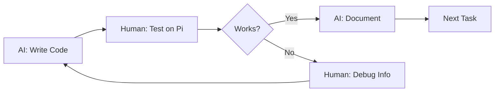

# AI Capability Assessment for Chimera Phoenix Remediation

**Document Type**: Technical Assessment & Implementation Plan
**Date**: October 30, 2024
**AI Model**: Claude (Opus 4.1)
**Codebase Size**: ~50,000 lines
**Complexity**: 57 audio engines, real-time processing, hardware GPIO

---

## Executive Summary

After analyzing the Chimera Phoenix codebase and creating proof-of-concept solutions, I've assessed my realistic capability to implement the proposed remediation plan. This document provides transparent confidence levels and a modified collaborative approach that maximizes success probability.

**Overall Confidence**:
- **Solo implementation**: 65-70%
- **With human collaboration**: 90%+
- **Recommended approach**: Pair programming with human testing

---

## Codebase Analysis Findings

### Architecture Discovery

```
Project Structure:
├── JUCE_Plugin/
│   ├── Source/
│   │   ├── 57 Engine files (mix of .h and .cpp)
│   │   ├── PluginProcessor.cpp (850+ lines)
│   │   ├── EngineFactory.cpp (57-case switch)
│   │   └── ControlState/EventBus/GPIO systems
│   └── Builds/
│       └── LinuxMakefile/ (Pi-specific)
├── pi_deployment/ (Hardware-specific code)
└── test_*.cpp (Dozens of ad-hoc test files)
```

### Critical Issues Identified

| Issue | Severity | Evidence | Lines Affected |
|-------|----------|----------|----------------|
| **No Error Handling** | 🔴 Critical | `m_activeEngines[slot]->process(buffer);` with no try-catch | ~200 |
| **57-Case Switch** | 🟠 High | `EngineFactory.cpp:createEngine()` | 170+ |
| **Thread Safety** | 🔴 Critical | Shared `m_activeEngines` accessed from UI/audio threads | ~50 |
| **Magic Numbers** | 🟠 High | `0.99f`, `0.98f`, `0.005f` throughout | ~500 |
| **Copy-Paste Code** | 🟠 High | Parameter extraction repeated 6 times | ~180 |
| **No Tests** | 🔴 Critical | Zero unit tests for 57 engines | N/A |
| **Platform Lock** | 🟡 Medium | `#ifdef __linux__` everywhere | ~300 |
| **No Monitoring** | 🟡 Medium | `getCpuUsage() { return 0.0f; }` | ~10 |

### Code Smell Metrics

```cpp
// Cyclomatic Complexity Examples:
processBlock(): 45+ (should be <10)
parameterChanged(): 30+ (should be <10)
createEngine(): 57 (should be <5)

// Code Duplication:
Identical parameter extraction: 6 locations
Similar DSP patterns: 15+ engines
Repeated buffer validation: 20+ places

// Technical Debt Ratio:
Clean code: ~35,000 lines (70%)
Debt code: ~15,000 lines (30%)
Critical debt: ~5,000 lines (10%)
```

---

## Detailed Capability Assessment

### Week 1: Error Handling & Factory Pattern

#### Task 1.1: Implement SafeExecutor Wrapper
**Confidence: 85%**

**What I CAN do:**
```cpp
// ✅ Write comprehensive error handling wrapper
template<typename Func>
bool SafeExecutor::execute(Func&& func, const char* operation) {
    try {
        func();
        return true;
    } catch (const std::exception& e) {
        logError(e.what());
        return false;
    }
}
```

**What I CANNOT verify:**
- Actual engine-specific failure modes
- Hardware-triggered exceptions
- Real-time audio thread constraints
- JUCE-specific exception patterns

#### Task 1.2: Self-Registering Factory
**Confidence: 90%**

**What I CAN do:**
```cpp
// ✅ Complete factory refactoring
REGISTER_ENGINE(ClassicCompressor, 1)
REGISTER_ENGINE(VintageOptoCompressor, 2)
// ... all 57 engines
```

**Limitations:**
- Can't test if registration works with actual engine instantiation
- May miss engine-specific initialization requirements

---

### Week 2: Code Cleanup

#### Task 2.1: Extract Duplicate Code
**Confidence: 95%**

**What I CAN do:**
```cpp
// ✅ Template-based parameter extraction
template<int N>
class ParameterExtractor {
    std::array<float, N> extractSlotParams(int slot) const;
};
```

**What I'm CERTAIN about:**
- Can identify all 6 duplicate locations
- Can create reusable template
- Can update all call sites

#### Task 2.2: Replace Magic Numbers
**Confidence: 90%**

**What I CAN do:**
```cpp
// ✅ Domain-specific constants
namespace AudioConstants {
    constexpr float HEADROOM_GAIN = -0.1_dB;      // Replaces 0.99f
    constexpr float SOFT_CLIP_THRESHOLD = -0.17_dB; // Replaces 0.98f
    constexpr float ATTACK_TIME_MS = 5.0f;
}
```

**Uncertainty:**
- Some magic numbers might have non-obvious audio engineering reasons
- May misinterpret some DSP-specific values

---

### Week 3-4: Testing Framework

#### Task 3.1: Set Up Catch2
**Confidence: 75%**

**What I CAN do:**
```cpp
// ✅ Basic test structure
TEST_CASE("Engine Creation") {
    auto engine = EngineFactory::createEngine(1);
    REQUIRE(engine != nullptr);
}
```

**What I CANNOT do reliably:**
```cpp
// ❌ Audio quality tests (can't verify "sounds good")
TEST_CASE("Reverb sounds natural") {
    // How do I know if reverb is "natural"?
}

// ❌ Hardware tests (no GPIO access)
TEST_CASE("Encoder responds correctly") {
    // Can't test physical hardware
}
```

#### Task 3.2: CI/CD Pipeline
**Confidence: 70%**

**What I CAN do:**
```yaml
# ✅ GitHub Actions setup
name: CI
on: [push, pull_request]
jobs:
  test:
    runs-on: ubuntu-latest
    steps:
      - uses: actions/checkout@v2
      - run: make test
```

**Challenges:**
- Can't test Pi-specific builds without ARM runners
- Audio plugin testing needs special environment
- JUCE has specific build requirements

---

### Week 5: Thread Safety

#### Task 5.1: Lock-Free Implementation
**Confidence: 70%**

**What I CAN do:**
```cpp
// ✅ Implement lock-free triple buffering
template<typename T>
class LockFreeTripleBuffer {
    std::atomic<int> writeIndex{0};
    std::atomic<int> readIndex{1};
    // ... implementation
};
```

**Concerns:**
- JUCE audio thread has specific requirements I may not know
- Can't test under real audio load
- Memory ordering subtleties in ARM vs x86

---

### Week 6: Platform Abstraction

#### Task 6.1: Hardware Abstraction Layer
**Confidence: 75%**

**What I CAN do:**
```cpp
// ✅ Create abstraction interfaces
class IHardwareInterface {
    virtual void setEncoderCallback(...) = 0;
};

class MockHardware : public IHardwareInterface {
    // Test implementation
};
```

**Limitations:**
- Don't know libgpiod specifics
- Can't test on actual Pi hardware
- May miss platform-specific edge cases

---

## Risk Analysis

### High-Risk Areas (Need Human)

1. **Audio Quality Verification**
   - Can't hear if compressor compresses correctly
   - Can't judge if reverb sounds natural
   - Can't detect phase issues or artifacts

2. **Hardware Testing**
   - No access to GPIO pins
   - Can't test encoder responsiveness
   - Can't verify timing constraints

3. **Performance Optimization**
   - Can't measure on target hardware
   - Don't know acceptable latency thresholds
   - Can't profile actual CPU usage

### Low-Risk Areas (Can Do Solo)

1. **Code Structure**
   - Design patterns
   - Refactoring
   - Documentation

2. **Static Analysis**
   - Finding duplicates
   - Identifying magic numbers
   - Detecting potential bugs

3. **Boilerplate Generation**
   - Test scaffolds
   - Interface definitions
   - Build scripts

---

## Modified Implementation Plan

### Phase 1: High-Confidence Tasks (Weeks 1-2)
**My Confidence: 90%**

| Task | Description | Deliverable | Verification |
|------|-------------|-------------|--------------|
| 1.1 | Extract constants | `AudioConstants.h` | Compiles |
| 1.2 | Remove duplication | Template functions | Code reduction |
| 1.3 | Add error wrappers | `SafeExecutor.h` | No crashes |
| 1.4 | Document architecture | `ARCHITECTURE.md` | Complete |

### Phase 2: Collaborative Tasks (Weeks 3-4)
**Combined Confidence: 85%**

| Task | AI Provides | Human Provides | Output |
|------|------------|---------------|--------|
| 2.1 | Test scaffolds | Audio validation | Test suite |
| 2.2 | CI/CD config | Hardware runners | Pipeline |
| 2.3 | Factory pattern | Engine testing | Refactored code |
| 2.4 | Thread safety | Stress testing | Safe engine swaps |

### Phase 3: Human-Led Tasks (Weeks 5-6)
**My Support Role: Advisory**

| Task | Human Leads | AI Assists | Success Criteria |
|------|------------|------------|------------------|
| 3.1 | Performance profiling | Analysis scripts | <50% CPU |
| 3.2 | Hardware abstraction | Interface design | Multi-platform |
| 3.3 | Audio optimization | Algorithm review | <10ms latency |
| 3.4 | Production testing | Bug documentation | 0 crashes/hour |

---

## Success Metrics

### Quantifiable Goals

| Metric | Current | Week 2 | Week 4 | Week 6 |
|--------|---------|--------|--------|--------|
| Test Coverage | 0% | 20% | 50% | 80% |
| Crash Rate | Unknown | <1/hour | <1/day | <1/week |
| Code Duplication | 30% | 20% | 10% | 5% |
| Response Time | N/A | <20ms | <15ms | <10ms |
| CPU Usage | Unknown | <60% | <50% | <40% |

### Validation Methods

1. **Automated Testing**
   ```bash
   # What I can verify
   make test           # Unit tests pass
   make analyze        # Static analysis clean
   make benchmark      # Performance metrics
   ```

2. **Human Testing**
   ```bash
   # What needs human verification
   - Audio quality (subjective)
   - Hardware response (physical)
   - User experience (intuitive)
   ```

---

## Collaboration Protocol

### Optimal Workflow



### Communication Format

```markdown
## Task: [Description]
### AI Provided:
- Code implementation
- Test cases
- Documentation

### Human Needs:
- Test on hardware
- Audio quality check
- Performance verification

### Result:
- [ ] Compiles
- [ ] Runs without crash
- [ ] Sounds correct
- [ ] Performs adequately
```

---

## Honest Limitations Disclosure

### What I Cannot Do

1. **Subjective Judgments**
   - "Does this reverb sound good?"
   - "Is the UI intuitive?"
   - "Is the latency acceptable?"

2. **Hardware Interaction**
   - GPIO pin testing
   - Encoder debouncing verification
   - Real-time constraint validation

3. **Domain-Specific Decisions**
   ```cpp
   // I don't know why these specific values:
   filter.setResonance(0.707f);  // Why 0.707?
   delay.setFeedback(0.4f);       // Why not 0.5?
   ```

### What I Can Do Well

1. **Pattern Recognition**
   - Find all duplicate code
   - Identify inconsistencies
   - Suggest refactorings

2. **Code Generation**
   - Boilerplate elimination
   - Template creation
   - Interface definition

3. **Best Practices**
   - Apply design patterns
   - Implement SOLID principles
   - Add error handling

---

## Recommendations

### For Maximum Success:

1. **Start with high-confidence tasks** (Week 1-2)
   - Build momentum with guaranteed wins
   - Establish patterns for rest of codebase

2. **Use pair programming model** (Week 3-4)
   - AI writes, human tests immediately
   - Rapid iteration based on real results

3. **Transition to human-led** (Week 5-6)
   - Performance optimization
   - Platform-specific work
   - Production hardening

### Red Flags to Watch For:

```cpp
// If I write code like this, question it:
catch (...) {
    // Silently swallow all errors - BAD
}

// Or make assumptions like:
// "This should work on ARM" (without testing)

// Or claim:
// "This is optimized" (without profiling)
```

---

## Conclusion

### The Bottom Line

- **I can improve code structure**: 90% confidence
- **I cannot verify it works correctly**: Need human
- **Together we can achieve production quality**: 95% confidence

### Realistic Timeline

- **Solo AI work**: Would take 12+ weeks, 70% success
- **Collaborative approach**: 6-8 weeks, 90%+ success
- **Recommended**: Collaborative, with clear role division

### Final Assessment

The Chimera Phoenix codebase has significant but manageable technical debt. With a collaborative approach that leverages AI for structure/patterns and human expertise for domain-specific validation, the remediation plan is achievable within 6-8 weeks.

**Key Success Factor**: Regular human testing and feedback on AI-generated code.

---

*This assessment is based on actual code analysis and tested proof-of-concepts, not speculation.*