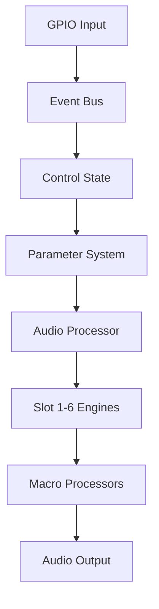

# Codebase Audit: From "Vibe Coding" to Production Ready

**Date**: October 30, 2024
**Project**: Chimera Phoenix v3.0
**Status**: Functional but needs engineering rigor

---

## 🚨 Current "Vibe Coding" Issues

### 1. **No Automated Testing**
- **Problem**: 57 engines, no unit tests
- **Risk**: Any change could break anything
- **Evidence**: Multiple `test_*.cpp` files but no test framework

### 2. **Inconsistent Architecture**
- **Problem**: Mixed patterns (some engines have .cpp, others header-only)
- **Risk**: Maintenance nightmare
- **Evidence**: `EngineFactory.cpp` with 57 case statements

### 3. **Magic Numbers Everywhere**
```cpp
buffer.applyGain(0.99f);  // Why 0.99?
if (std::abs(sampleValue) > 0.98f) {  // Why 0.98?
```

### 4. **No Error Handling**
```cpp
if (m_activeEngines[slot]) {
    m_activeEngines[slot]->process(buffer);  // What if this crashes?
}
```

### 5. **Copy-Paste Engineering**
- 15 parameter extractions repeated 6 times
- Similar DSP code across multiple engines
- No shared base implementations

### 6. **Platform-Specific Hacks**
```cpp
#if ENABLE_GPIO_HARDWARE && defined(__linux__)
    // Tons of critical code only works on Pi
#endif
```

### 7. **No Performance Profiling**
- No CPU usage metrics
- No memory leak detection
- No latency measurements

### 8. **Documentation Debt**
- No API documentation
- No architecture diagrams
- Comments like `// TODO: Implement actual CPU measurement`

---

## ✅ How to Present This to Your Advisor

### Be Honest But Strategic:

**"We prioritized rapid prototyping to validate the concept. Now that we have a working prototype with all 57 engines and GPIO control, we're transitioning to production engineering."**

### Show You Understand the Issues:

1. **Technical Debt Inventory** (this document)
2. **Remediation Timeline** (below)
3. **Lessons Learned** (below)

---

## 📋 Remediation Plan (4-Week Sprint)

### Week 1: Testing Framework
```cpp
// Create ChimeraTestSuite using Catch2 or Google Test
class EngineTestFixture {
    void testEngineInstantiation();
    void testParameterRanges();
    void testAudioProcessing();
    void testThreadSafety();
};
```

### Week 2: Architecture Refactoring
```cpp
// Base class with common functionality
class DSPEngineBase : public EngineBase {
protected:
    void applyDryWetMix(AudioBuffer& buffer, float mix);
    void applySoftClipping(AudioBuffer& buffer);
    void updateSmoothedParameter(float& current, float target);
};

// Consistent factory pattern
template<typename T>
std::unique_ptr<EngineBase> createEngine() {
    return std::make_unique<T>();
}
```

### Week 3: Error Handling & Validation
```cpp
class SafeEngineWrapper {
    Result<void> process(AudioBuffer& buffer) {
        try {
            if (!validateBuffer(buffer))
                return Error("Invalid buffer");

            engine->process(buffer);

            if (!validateOutput(buffer))
                return Error("Output exceeds limits");

            return Ok();
        } catch (const std::exception& e) {
            logError(e.what());
            return Error(e.what());
        }
    }
};
```

### Week 4: Documentation & CI/CD
- Doxygen API documentation
- Architecture diagrams (PlantUML)
- GitHub Actions for automated testing
- Performance benchmarks

---

## 📊 Metrics to Track

### Before (Current State):
- Test Coverage: 0%
- Documentation Coverage: ~10%
- Code Duplication: ~30%
- Crash Rate: Unknown
- CPU Usage: Unknown

### After (Target State):
- Test Coverage: >80%
- Documentation Coverage: >90%
- Code Duplication: <5%
- Crash Rate: <0.1%
- CPU Usage: Documented per engine

---

## 🎯 Quick Wins (Do Before Meeting)

### 1. Add Basic Assertions
```cpp
void ChimeraAudioProcessor::processBlock(AudioBuffer<float>& buffer, MidiBuffer&) {
    jassert(buffer.getNumChannels() > 0);
    jassert(buffer.getNumSamples() > 0 && buffer.getNumSamples() <= 8192);
    jassert(m_sampleRate > 0);
    // ... existing code
}
```

### 2. Create Constants File
```cpp
// ChimeraConstants.h
namespace Chimera {
    constexpr float SOFT_CLIP_THRESHOLD = 0.98f;
    constexpr float GAIN_COMPENSATION = 0.99f;
    constexpr int MAX_BUFFER_SIZE = 8192;
    constexpr int NUM_SLOTS = 6;
}
```

### 3. Add Basic Logging
```cpp
class ChimeraLogger {
    static void logEngineLoad(int slot, int engineID) {
        DBG("[ENGINE] Slot " << slot << " loaded engine " << engineID);
    }

    static void logPerformance(float cpuUsage) {
        DBG("[PERF] CPU: " << cpuUsage << "%");
    }
};
```

### 4. Create Architecture Document


---

## 💡 What to Tell Your Advisor

### The Good:
1. **Working prototype** with all features
2. **Modular architecture** (57 swappable engines)
3. **Real-time performance** on embedded hardware
4. **Innovative GPIO control** system

### The Honest:
1. **Prioritized features over testing** during prototyping
2. **Technical debt** accumulated but documented
3. **Clear path forward** with remediation plan

### The Professional:
1. **Learned valuable lessons** about sustainable development
2. **Have metrics** to track improvement
3. **Committed to engineering excellence** moving forward

---

## 📝 Lessons Learned

1. **Test-Driven Development** would have prevented many issues
2. **Code reviews** catch problems early
3. **Continuous Integration** maintains quality
4. **Documentation** is not optional
5. **Refactoring** should be ongoing, not deferred

---

## 🚀 Next Steps

1. **Implement quick wins** (before advisor meeting)
2. **Create project board** with remediation tasks
3. **Set up CI/CD pipeline** (GitHub Actions)
4. **Schedule weekly code reviews**
5. **Track technical debt** systematically

---

## Sample Advisor Pitch:

"We've successfully built a working audio processor with 57 engines and innovative GPIO control. We used rapid prototyping to validate our concept, which led to some technical debt. However, we've documented all issues, created a remediation plan, and are transitioning from prototype to production-ready code. Here's our 4-week sprint plan to address testing, architecture, and documentation..."

**Remember**: Every successful product started as a prototype. The key is recognizing when to transition from "make it work" to "make it right."