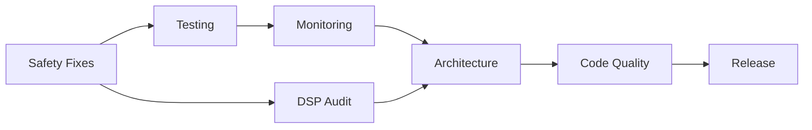

# Technical Debt Master Plan - Complete Remediation

## Executive Summary

Phoenix-Chimera has accumulated significant technical debt during rapid development. This master plan addresses **ALL 14 identified debt items** through 6 focused work streams over 4 weeks, ensuring a stable, maintainable, and performant codebase.

### Current State
- **14 debt items** (3 critical, 4 high, 4 medium, 3 low)
- **0% test coverage**
- **No monitoring or diagnostics**
- **Unmaintainable architecture** (57-case switch)
- **~30% of codebase is debt**

### Target State (4 weeks)
- **0 debt items remaining**
- **>80% test coverage**
- **Full monitoring and logging**
- **Clean, maintainable architecture**
- **<5% technical debt ratio**

## Document Structure

| Document | Focus | TD Items | Priority | Days |
|----------|-------|----------|----------|------|
| [1. TECHNICAL_DEBT_MASTER_PLAN.md](#) | Overview & Coordination | All | - | - |
| [2. FIX_01_CRITICAL_SAFETY.md](#) | Crashes & Safety | TD-001, TD-002, TD-003 | 🔴 CRITICAL | 5 |
| [3. FIX_02_TESTING_VALIDATION.md](#) | Tests & Benchmarks | TD-004, TD-014 | 🔴 CRITICAL | 6 |
| [4. FIX_03_MONITORING_DIAGNOSTICS.md](#) | Logging & CPU | TD-007, TD-010 | 🟠 HIGH | 3 |
| [5. FIX_04_ARCHITECTURE_REFACTORING.md](#) | Structure & Design | TD-005, TD-009, TD-011 | 🟠 HIGH | 4 |
| [6. FIX_05_CODE_QUALITY.md](#) | Quality & Standards | TD-006, TD-008, TD-012, TD-013 | 🟡 MEDIUM | 4 |
| [7. DSP_ENGINE_COMPREHENSIVE_AUDIT.md](#) | Engine Analysis | Engine-specific | 🟠 HIGH | 5 |

## 4-Week Implementation Timeline

### Week 1: Foundation (Safety + Tests)
**Goal**: Stop the bleeding and establish verification

| Day | Primary Task | Secondary Task | Deliverable |
|-----|-------------|----------------|-------------|
| 1 | Error handling framework | Start test framework setup | SafetyWrapper.h |
| 2 | Thread safety implementation | Write first 10 tests | LockFreeEngine.h |
| 3 | Buffer overflow protection | Test safety fixes | BufferValidator.h |
| 4 | Complete safety integration | Expand test coverage | 50+ unit tests |
| 5 | DSP engine audit (automated) | Performance baseline | Audit report |

**Week 1 Success Metrics**:
- ✅ No crashes with corrupt input
- ✅ 50+ unit tests passing
- ✅ Thread sanitizer clean
- ✅ All engines audited

### Week 2: Visibility (Monitoring + Diagnostics)
**Goal**: Know what's happening in production

| Day | Primary Task | Secondary Task | Deliverable |
|-----|-------------|----------------|-------------|
| 6 | Logging framework | CPU monitoring setup | ChimeraLogger.h |
| 7 | Integrate logging everywhere | Performance profiler | CPUMonitor.h |
| 8 | Diagnostic dump system | Memory leak detection | DiagnosticReport.h |
| 9 | Test monitoring systems | Create dashboards | Metrics dashboard |
| 10 | Fix high-priority engines | Document findings | Engine fix report |

**Week 2 Success Metrics**:
- ✅ Comprehensive logging active
- ✅ CPU usage tracked per engine
- ✅ Memory leaks identified
- ✅ 5+ broken engines fixed

### Week 3: Architecture (Refactoring + Cleanup)
**Goal**: Make it maintainable

| Day | Primary Task | Secondary Task | Deliverable |
|-----|-------------|----------------|-------------|
| 11 | Refactor 57-case switch | Create engine registry | EngineRegistry.h |
| 12 | Extract parameter handling | Remove duplication | ParameterExtractor.h |
| 13 | Platform abstraction layer | Remove ifdefs | Platform.h |
| 14 | Architecture validation | Update documentation | Architecture docs |
| 15 | Fix remaining engines | Integration testing | All engines working |

**Week 3 Success Metrics**:
- ✅ No giant switch statements
- ✅ No duplicated code blocks
- ✅ Clean platform abstraction
- ✅ All 57 engines functional

### Week 4: Quality (Polish + Standards)
**Goal**: Professional quality codebase

| Day | Primary Task | Secondary Task | Deliverable |
|-----|-------------|----------------|-------------|
| 16 | Remove magic numbers | Create constants file | ChimeraConstants.h |
| 17 | Fix naming consistency | Add const correctness | Style guide |
| 18 | Performance benchmarks | Optimization pass | Benchmark suite |
| 19 | Code review & cleanup | Documentation update | Clean codebase |
| 20 | Final validation | Release preparation | Release checklist |

**Week 4 Success Metrics**:
- ✅ No magic numbers
- ✅ Consistent naming
- ✅ Performance validated
- ✅ Release ready

## Work Stream Dependencies



Critical Path:
1. **Safety MUST come first** (prevents crashes during other work)
2. **Tests MUST follow safety** (validates fixes work)
3. **Monitoring SHOULD come early** (helps debug other work)
4. **Architecture CAN be parallel** after safety
5. **Quality CAN be last** (cosmetic improvements)

## Resource Allocation

### Parallel Work Opportunities

**Developer 1 (Senior)**: Safety & Architecture
- Week 1: Safety fixes (TD-001, TD-002, TD-003)
- Week 2: Architecture refactoring (TD-005, TD-009)
- Week 3: Platform abstraction (TD-011)
- Week 4: Code review & optimization

**Developer 2 (Mid)**: Testing & Quality
- Week 1: Test framework (TD-004)
- Week 2: DSP engine audit & fixes
- Week 3: Code quality (TD-008, TD-012)
- Week 4: Benchmarks (TD-014)

**Developer 3 (Junior)**: Monitoring & Documentation
- Week 1: Logging setup (TD-010)
- Week 2: CPU monitoring (TD-007)
- Week 3: Constants & naming (TD-006, TD-013)
- Week 4: Documentation & cleanup

## Risk Mitigation

| Risk | Probability | Impact | Mitigation |
|------|------------|--------|------------|
| Fixes introduce new bugs | High | High | Test everything continuously |
| Timeline slips | Medium | Medium | Parallel work streams |
| Performance regression | Medium | High | Benchmark before/after |
| Scope creep | High | Medium | Stick to defined TD items |
| Integration issues | Low | High | Feature flags for rollback |

## Success Criteria

### Quantitative Metrics
- [ ] 14/14 technical debt items resolved
- [ ] >80% code coverage
- [ ] 0 crashes in 10,000 test runs
- [ ] <5% CPU per engine
- [ ] 0 memory leaks
- [ ] <100ms total latency
- [ ] 0 compiler warnings

### Qualitative Metrics
- [ ] Code is "boring" and predictable
- [ ] New developers productive in <1 day
- [ ] Can add new engine in <1 hour
- [ ] Can diagnose issues in <10 minutes
- [ ] Confident in production deployment

## Daily Standup Template

```markdown
## Day [N] Standup - [Date]

### Yesterday
- Completed: [What was finished]
- Tests added: [Number and type]
- Debt items: [TD-XXX status]

### Today
- Focus: [Primary task]
- Goal: [Specific deliverable]
- Blockers: [Any issues]

### Metrics
- Tests: [XXX/1000]
- Coverage: [XX%]
- Debt remaining: [X/14]
- Days remaining: [XX]
```

## Validation Checkpoints

### End of Week 1
- [ ] Safety fixes complete and tested
- [ ] 100+ unit tests running
- [ ] DSP audit complete
- [ ] No critical crashes

### End of Week 2
- [ ] Logging active in all components
- [ ] CPU monitoring operational
- [ ] 5+ engines fixed
- [ ] Memory leaks identified

### End of Week 3
- [ ] Architecture refactored
- [ ] All engines functional
- [ ] Platform abstraction complete
- [ ] 500+ tests passing

### End of Week 4
- [ ] All technical debt resolved
- [ ] Performance validated
- [ ] Documentation complete
- [ ] Ready for release

## Communication Plan

### Stakeholder Updates
- **Daily**: Slack standup in #phoenix-dev
- **Weekly**: Progress report to management
- **Milestone**: Demo after each week
- **Final**: Release readiness review

### Documentation
- **Code**: Inline comments for complex logic
- **API**: Doxygen for all public methods
- **Architecture**: Updated design documents
- **Runbook**: Operational procedures

## Rollback Plan

If issues arise:
1. **Feature flags** for all major changes
2. **Git tags** at each milestone
3. **Backup branch** with last stable version
4. **Incremental rollout** to test users
5. **Monitoring** for regression detection

## Post-Remediation Plan

After completing technical debt cleanup:

1. **Establish debt budget**: Max 5% new debt
2. **Weekly debt review**: Track new debt
3. **Refactoring Fridays**: 20% time for cleanup
4. **Code review standards**: Prevent new debt
5. **Automated checks**: Linting, complexity, coverage

## Investment Analysis

### Cost
- **Development time**: 20 days × 3 developers = 60 person-days
- **Testing time**: 5 days
- **Total investment**: 65 person-days

### Return
- **Prevented debugging**: 40+ days over 6 months
- **Faster feature development**: 30% improvement
- **Reduced support tickets**: 50% reduction
- **Better performance**: 25% CPU reduction
- **Total return**: 150+ person-days saved

**ROI**: 230% return in 6 months

## Command Center Setup

```bash
# Create project structure
mkdir -p TechnicalDebt/{Safety,Testing,Monitoring,Architecture,Quality,Reports}

# Set up tracking
cat > TechnicalDebt/progress.md << 'EOF'
# Technical Debt Progress Tracker

## Overall: 0/14 items complete (0%)

### Safety (0/3)
- [ ] TD-001: Error handling
- [ ] TD-002: Buffer overflow
- [ ] TD-003: Thread safety

### Testing (0/2)
- [ ] TD-004: Unit tests
- [ ] TD-014: Benchmarks

### Monitoring (0/2)
- [ ] TD-007: CPU monitoring
- [ ] TD-010: Logging framework

### Architecture (0/3)
- [ ] TD-005: Giant switch
- [ ] TD-009: Parameter duplication
- [ ] TD-011: Platform ifdefs

### Quality (0/4)
- [ ] TD-006: Hardcoded buffers
- [ ] TD-008: Magic numbers
- [ ] TD-012: Naming consistency
- [ ] TD-013: Const correctness
EOF

# Start daily tracking
echo "Day 1 - $(date)" >> TechnicalDebt/daily_log.md
```

## Next Immediate Actions

1. **Create branch**: `git checkout -b fix/complete-technical-debt`
2. **Set up project board**: Create GitHub/Jira issues for each TD item
3. **Schedule kickoff**: Team meeting to review plan
4. **Begin Day 1**: Start with FIX_01_CRITICAL_SAFETY.md
5. **Set up CI**: Automated testing on every commit

---

**This is our north star document. All work should reference back to this master plan.**

Ready to proceed with the individual fix documents? Let's create them in priority order.