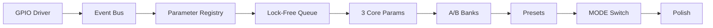

# Trinity GPIO Control - 4-Week Beta Plan

**Version:** 2.0 (Pragmatic Edition)
**Date:** October 23, 2025
**Timeline:** 4 weeks to beta-ready control
**Philosophy:** Ship playable control now, add magic later

---

## 🎯 Executive Summary

Trimmed from 12-16 weeks to **4 weeks of focused development** by deferring non-essential features. This delivers a **working control system** with presets, A/B banks, and two modes for beta, while keeping architecture clean for future expansion.

**Core Features (v0.5 Beta):**
- ✅ Event bus + state machine (MODE only)
- ✅ Parameter registry (3-6 core params to start)
- ✅ A/B parameter banks (no morph yet)
- ✅ Atomic JSON presets
- ✅ MODE switch (PRESET + MIX modes)

**Deferred Features (v1.1+):**
- ⏳ Morph interpolation (center position)
- ⏳ LIVE performance layer
- ⏳ Touch focus with timeout
- ⏳ Macro JSON authoring UI
- ⏳ Parallel/hybrid routing

---

## 📅 Week-by-Week Roadmap

### **Week 1: Foundation (Oct 23-29)**
**Goal:** Event bus, state machine, and 3 working parameters

**Ship:**
- [x] GPIO drivers (3 encoders w/ push, 3× 3-way switches) ✅ DONE TODAY
- [x] UI display components showing hardware state ✅ DONE TODAY
- [ ] Event bus + State (mode tracking only)
- [ ] Parameter registry + lock-free param queue
- [ ] Wire 3 params: `input.gain`, `mix.wetdry`, `output.level`
- [ ] Connect hardware callbacks to actual parameters

**Done When:** Turning knobs changes audio smoothly, HUD accurate, no xruns/pops

### **Week 2: Presets (Oct 30 - Nov 5)**
**Goal:** Load/save presets with A/B banks

**Ship:**
- [ ] RAM presets (10 slots), E1 browse, E1 push to load
- [ ] A/B banks (Switch-2 toggles A/B)
- [ ] JSON presets on disk (atomic temp→rename)
- [ ] E2 short-press = Quick Save
- [ ] Preset index cache

**Done When:** Load → tweak A → flip to B → tweak → save → reboot → everything's there

### **Week 3: Engines + MODE (Nov 6-12)**
**Goal:** Engines register parameters, MODE switch changes behavior

**Ship:**
- [ ] Engines register parameters with registry
- [ ] Preset graph stores serial chain + engine IDs
- [ ] MODE switch mappings:
  - **PRESET:** E1 browse/load, E2 wet/dry, E3 output
  - **MIX:** E1 tone macro, E2 space macro, E3 output
  - **AI:** placeholders (labels only)
- [ ] 300ms mode-latch + encoder pickup (no jumps)

**Done When:** Two modes feel distinct, no parameter jumps, engine params recall reliably

### **Week 4: Polish + QA (Nov 13-15)**
**Goal:** Beta-ready stability and UX

**Ship:**
- [ ] Unsaved-dot indicator for A/B edits
- [ ] Single-level undo in RAM
- [ ] Graceful error handling on preset load
- [ ] Performance validation (CPU, no clicks on A↔B)
- [ ] Developer toggles/logging (can disable for live)

**Done When:** Can demo load → tweak → A/B compare → save with zero surprises

---

## 🏗️ Minimum Architecture (Future-Proof)

### **1. Parameter Registry (Do Now)**
```cpp
class ParameterRegistry {
    // Even for 3 params, this is the spine
    struct ParamSpec {
        String id;           // "mix.wetdry"
        float min, max;
        float defaultValue;
        String displayName;  // "Mix"
    };

    void registerParam(ParamSpec spec);
    float normalize(String id, float value);
};
```

### **2. A/B Banks (Do Now)**
```cpp
class ABStateEngine {
    // Build dual banks today, add morph later
    ParamBank bankA, bankB;
    bool activeBank;  // false=A, true=B

    void setParameter(String id, float value) {
        (activeBank ? bankB : bankA)[id] = value;
    }
};
```

### **3. Event Bus (Do Now)**
```cpp
class EventBus {
    // Simple but extensible
    void post(Event e);  // Thread-safe
    void process();      // Main thread
};
```

### **4. Ownership Rules (Stub Now)**
```cpp
enum Priority {
    BASE = 0,
    MODE = 1,
    ICON_FOCUS = 2,  // Stub for later
    LIVE = 3          // Stub for later
};
```

---

## 🛡️ Guardrails for Simplicity

### **Encoder Behavior**
- **Relative + Pickup:** On mode switch, ignore deltas until pickup
- **Catch Indicator:** Show tiny UI hint when waiting for pickup
- **No Acceleration:** Keep it linear for now

### **A/B Scope**
- **Writes are scoped:** Only active bank gets edits
- **Clear indicators:** Always show which bank is active
- **Instant switch:** No fade/interpolation yet

### **Preset Safety**
- **Atomic saves:** Write temp → fsync → rename
- **Corruption handling:** Bad file won't crash, shows error
- **Auto-backup:** Keep last good preset

### **Audio Thread**
- **Lock-free only:** Consumes deltas from FIFO
- **No filesystem:** Never touches disk/UI/locks
- **Smooth updates:** Parameter smoothing over 10ms

---

## 📋 Implementation Order



---

## ✅ Acceptance Criteria (Per Week)

### **Week 1 Checklist**
- [ ] Encoders change values smoothly
- [ ] No audio clicks/pops
- [ ] UI updates in real-time
- [ ] Can adjust all 3 params

### **Week 2 Checklist**
- [ ] Can load any of 10 presets
- [ ] A/B switching is instant
- [ ] Edits stay in correct bank
- [ ] Presets survive reboot

### **Week 3 Checklist**
- [ ] MODE switch changes encoder behavior
- [ ] No parameter jumps on mode change
- [ ] Engine params save/recall
- [ ] Macros feel musical

### **Week 4 Checklist**
- [ ] 60-second new user test passes
- [ ] No crashes on bad input
- [ ] CPU stays under 45%
- [ ] Feels professional

---

## 🚀 Quick Start (Day 1)

```cpp
// Start with the simplest possible event bus
class SimpleEventBus {
public:
    struct Event {
        enum Type { ENCODER_TURN, SWITCH_CHANGE };
        Type type;
        int device;  // 0-2
        int value;   // delta or position
    };

    void post(Event e) {
        std::lock_guard<std::mutex> lock(mutex);
        queue.push(e);
    }

    bool pop(Event& e) {
        std::lock_guard<std::mutex> lock(mutex);
        if (queue.empty()) return false;
        e = queue.front();
        queue.pop();
        return true;
    }

private:
    std::queue<Event> queue;
    std::mutex mutex;
};
```

---

## 📊 Reality Check

**Original Estimate:** 12-16 weeks, ~10,000 LOC
**Pragmatic Estimate:** 4 weeks, ~2,000 LOC
**Why the difference?**
- No morph complexity (-3 weeks)
- No LIVE layer (-2 weeks)
- No touch focus (-1 week)
- Simpler macro system (-2 weeks)
- No parallel routing (-2 weeks)

**This is the right call.** Ship working control for beta, add magic features when you have user feedback.

---

## 🎯 Success Metrics

**Beta Success (Week 4):**
- Users can control the device without documentation
- No crashes in 4-hour session
- A/B comparison feels instant
- MODE switch is intuitive

**Future Success (v1.1):**
- Morph creates new sounds
- LIVE mode enables performance
- Touch focus speeds up editing

---

## 💡 Next Actions

**Today (Oct 23):**
1. ~~Review & approve this plan~~ ✅
2. ~~GPIO driver already integrated~~ ✅
3. Create SimpleEventBus skeleton
4. Wire encoder callbacks to parameters
5. Test first param control (output.level)

**Tomorrow:**
1. Add remaining 2 parameters
2. Create basic HUD display
3. Test encoder responsiveness

**This Week:**
1. Complete Week 1 foundation
2. Start RAM preset structure
3. Test with real hardware

---

## 🏁 Conclusion

This pragmatic 4-week plan delivers **exactly what's needed for beta** without overengineering. The architecture supports future features without requiring rewrites. Most importantly, it's **achievable by a solo developer**.

**The mantra:** Working beats perfect. Ship the core, iterate on the magic.

---

*"From 16 weeks to 4 weeks - because shipping beats dreaming."*