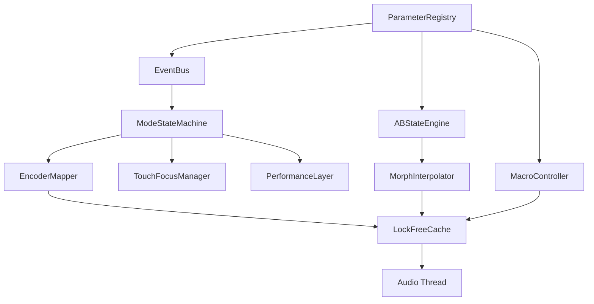

# Trinity GPIO Control Stack - Implementation Plan

**Document Version:** 1.0
**Date:** October 20, 2025
**Project:** Chimera Phoenix v3.0
**Target:** Raspberry Pi with GPIO Hardware

---

## 🎯 Executive Summary

The Trinity Control Stack v0.5 spec defines a sophisticated control system that transforms our basic GPIO hardware (3 encoders + 3 switches) into a professional performance controller with:

- **4 Control Modes:** PRESET, MIX, AI, and LIVE performance layers
- **A/B/Morph Engine:** Dual parameter banks with real-time interpolation
- **Macro System:** Musical gestures mapped to parameter groups
- **Touch Focus:** Temporary encoder control with timeout
- **Lock-Free Audio:** Zero-glitch parameter updates

**Development Estimate:** 12-16 weeks, ~10,000 lines of new code

---

## 📊 Current State vs Target State

### **What We Have Now**
```
Simple Direct Control:
GPIO Hardware → HardwareController → Parameters → DSP Engines
```

**Components:**
- ✅ HardwareController.cpp/h - Basic GPIO reading
- ✅ 57 DSP Engines - Working audio processing
- ✅ Trinity AI - Preset generation
- ✅ Basic APVTS - Parameter management
- ✅ Simple preset save/load

### **What We're Building**
```
Sophisticated Control Stack:
Hardware → Event Bus → State Machine → Registry → A/B/Morph → Lock-Free → DSP
         ↓            ↓              ↓         ↓          ↓
      Touch UI    Mode Control   Macros   Performance  Audio Thread
```

**New Components Needed:**
1. Parameter Registry System
2. Macro Controller
3. A/B State Engine
4. Morph Interpolator
5. Mode State Machine
6. Event Bus Architecture
7. Touch Focus Manager
8. Performance Layer
9. Lock-Free Parameter Cache
10. Atomic Preset System

---

## 🏗️ Architecture Overview

### **Layer 1: Hardware & UI (Existing + Enhanced)**
```cpp
// Current
HardwareController → Direct parameter control

// Target
HardwareController → EventBus → ModeStateMachine → EncoderMapper → Parameters
TouchScreen → EventBus → FocusManager → EncoderMapper → Parameters
```

### **Layer 2: Event System (NEW)**
```cpp
class EventBus {
    // Central routing for all control events
    void post(Event e);  // Thread-safe posting
    void subscribe(EventType, Handler);
    void process();  // Main thread processing
};

enum EventType {
    ENCODER_TURN, ENCODER_PRESS, SWITCH_CHANGE,
    MODE_CHANGE, VARIANT_CHANGE, TOUCH_FOCUS,
    AI_RESULT, PRESET_LOAD
};
```

### **Layer 3: State Management (NEW)**
```cpp
struct ControlState {
    Mode mode;           // PRESET | MIX | AI
    Variant variant;     // A | MORPH | B
    bool liveActive;     // Performance layer on/off
    Focus focus;         // Current encoder owner
    uint64_t focusTime;  // For timeout
};

class ModeStateMachine {
    ControlState state;
    void handleEvent(Event e);
    EncoderBehavior getEncoderMapping(int encoder);
};
```

### **Layer 4: Parameter System (ENHANCED)**
```cpp
class ParameterRegistry {
    // Single source of truth for all parameters
    struct ParamSpec {
        String id;           // "rev1.size"
        Type type;           // FLOAT, INT, ENUM, BOOL
        Range range;         // min/max or enum values
        float defaultValue;
        String unit;         // "ms", "dB", "%"
        bool morphable;      // Can interpolate?
        String displayName;  // "Reverb Size"
    };

    void registerParam(ParamSpec spec);
    ParamSpec getSpec(String id);
    float normalize(String id, float value);
    float denormalize(String id, float normalized);
};
```

### **Layer 5: A/B/Morph Engine (NEW)**
```cpp
class ABMorphEngine {
    // Dual parameter banks with interpolation
    struct ParamBank {
        std::map<String, float> values;  // Normalized 0-1
    };

    ParamBank bankA;
    ParamBank bankB;
    float morphAlpha;  // 0=A, 1=B

    float getInterpolatedValue(String paramId) {
        return lerp(bankA[paramId], bankB[paramId], morphAlpha);
    }

    void setMorphPosition(float alpha);
    void copyAtoB();
    void swapBanks();
};
```

### **Layer 6: Lock-Free Audio Interface (NEW)**
```cpp
class LockFreeParamCache {
    // Wait-free parameter access for audio thread
    struct ParamUpdate {
        int paramIndex;
        float value;
        uint64_t timestamp;
    };

    juce::AbstractFifo fifo;
    ParamUpdate updates[1024];

    void pushUpdate(int param, float value);  // Control thread
    bool popUpdate(ParamUpdate& out);         // Audio thread
};
```

---

## 🚀 Implementation Sprints

### **Sprint 0: Foundation (Week 1)**
**Goal:** Event bus and basic state machine

**Tasks:**
- [ ] Create EventBus class with thread-safe posting
- [ ] Define all event types and payloads
- [ ] Implement ControlState structure
- [ ] Create basic ModeStateMachine
- [ ] Wire HardwareController to EventBus
- [ ] Add debug event logging

**Deliverable:** Events flow from hardware to state machine

### **Sprint 1: Parameter Registry (Week 2)**
**Goal:** Central parameter metadata system

**Tasks:**
- [ ] Create ParameterRegistry class
- [ ] Define ParamSpec structure
- [ ] Register all 57 engines' parameters (~500 total)
- [ ] Add normalization/denormalization
- [ ] Create parameter lookup system
- [ ] Unit tests for registry

**Deliverable:** All parameters registered with metadata

### **Sprint 2: A/B State Engine (Week 3-4)**
**Goal:** Dual parameter banks

**Tasks:**
- [ ] Create ABStateEngine with two banks
- [ ] Implement bank switching (A/B)
- [ ] Add copy/swap operations
- [ ] Wire to parameter updates
- [ ] Create bank persistence (save/load)
- [ ] Test with multiple engines

**Deliverable:** Can switch between A/B parameter sets

### **Sprint 3: Morph Interpolator (Week 5-6)**
**Goal:** Real-time parameter interpolation

**Tasks:**
- [ ] Create MorphInterpolator class
- [ ] Implement linear interpolation
- [ ] Add easing curves (ease-in/out)
- [ ] Handle non-morphable parameters
- [ ] Optimize for real-time (SIMD?)
- [ ] Create morph time/automation

**Deliverable:** Smooth morphing between A and B

### **Sprint 4: Mode Control (Week 7)**
**Goal:** MODE switch changes encoder behavior

**Tasks:**
- [ ] Implement PRESET mode (browse/load/save)
- [ ] Implement MIX mode (macros)
- [ ] Implement AI mode (generate/refine)
- [ ] Create EncoderMapper for each mode
- [ ] Add visual feedback for mode changes
- [ ] Test mode transitions

**Deliverable:** Three modes with distinct behaviors

### **Sprint 5: Macro System (Week 8-9)**
**Goal:** Musical control gestures

**Tasks:**
- [ ] Create MacroController class
- [ ] Define macro mappings (Tone/Space/Energy)
- [ ] Load macro definitions from JSON
- [ ] Implement weighted parameter control
- [ ] Add curve support
- [ ] Test with common use cases

**Deliverable:** MIX mode controls macro parameters

### **Sprint 6: Performance Layer (Week 10)**
**Goal:** LIVE mode for real-time tweaking

**Tasks:**
- [ ] Create PerformanceLayer class
- [ ] Implement additive offsets
- [ ] Add MIDI learn capability
- [ ] Create safe exit (ease back)
- [ ] Wire to LIVE switch
- [ ] Test with live performance scenarios

**Deliverable:** LIVE switch enables performance mode

### **Sprint 7: Touch Focus (Week 11)**
**Goal:** Touchscreen temporary control

**Tasks:**
- [ ] Create TouchFocusManager
- [ ] Implement focus timeout (10s)
- [ ] Add visual feedback (halos/banners)
- [ ] Handle switch override
- [ ] Create per-page focus targets
- [ ] Test touch interactions

**Deliverable:** Touch can temporarily control encoders

### **Sprint 8: Lock-Free Integration (Week 12)**
**Goal:** Glitch-free audio updates

**Tasks:**
- [ ] Create LockFreeParamCache
- [ ] Implement wait-free FIFO
- [ ] Add parameter smoothing
- [ ] Handle atomic preset loads
- [ ] Test for audio glitches
- [ ] Stress test with rapid changes

**Deliverable:** Zero audio glitches during control

### **Sprint 9: Polish & Integration (Week 13-14)**
**Goal:** Complete system integration

**Tasks:**
- [ ] Full system integration testing
- [ ] Fix edge cases and bugs
- [ ] Optimize performance
- [ ] Add comprehensive logging
- [ ] Create user documentation
- [ ] Record demo videos

**Deliverable:** Feature-complete v0.5

---

## 📋 Component Build Order & Dependencies



**Critical Path:**
1. ParameterRegistry (foundation for everything)
2. EventBus (communication backbone)
3. ABStateEngine (core feature)
4. MorphInterpolator (core feature)
5. LockFreeCache (audio safety)

---

## 🔧 Technical Implementation Details

### **1. Lock-Free Parameter Updates**
```cpp
// Control thread
void updateParameter(int param, float value) {
    // No locks - just push to FIFO
    lockFreeCache.pushUpdate(param, value);
}

// Audio thread
void processBlock(AudioBuffer& buffer) {
    // Pull all pending updates
    ParamUpdate update;
    while (lockFreeCache.popUpdate(update)) {
        engines[slot]->setParameter(update.paramIndex, update.value);
    }
    // Process audio
    engines[slot]->process(buffer);
}
```

### **2. Mode-Specific Encoder Behaviors**
```cpp
// Each mode defines encoder personalities
void handleEncoder(int encoder, int delta) {
    switch (state.mode) {
        case PRESET:
            if (encoder == 0) browsePresets(delta);
            if (encoder == 1) adjustWetDry(delta);
            if (encoder == 2) adjustOutput(delta);
            break;

        case MIX:
            if (encoder == 0) adjustMacro("tone", delta);
            if (encoder == 1) adjustMacro("space", delta);
            if (encoder == 2) adjustMacro("energy", delta);
            break;

        case AI:
            if (encoder == 0) adjustComplexity(delta);
            if (encoder == 1) refineResult(delta);
            if (encoder == 2) evolvePreset(delta);
            break;
    }
}
```

### **3. A/B Morph Implementation**
```cpp
// Real-time interpolation
void updateMorphedParameters() {
    for (auto& [id, specA] : bankA) {
        float valueA = bankA[id];
        float valueB = bankB[id];

        if (registry.getSpec(id).morphable) {
            // Smooth interpolation
            float morphed = lerp(valueA, valueB, morphAlpha);
            sendToAudio(id, morphed);
        } else {
            // Step at 50% point
            float selected = (morphAlpha < 0.5f) ? valueA : valueB;
            sendToAudio(id, selected);
        }
    }
}
```

---

## 🧪 Testing Strategy

### **Unit Tests (Each Sprint)**
- Parameter registry CRUD operations
- Event bus message routing
- State machine transitions
- Morph interpolation accuracy
- Lock-free FIFO integrity

### **Integration Tests (Sprints 4, 7, 9)**
- Hardware → Event → State → Parameter flow
- Mode switching without glitches
- A/B/Morph with all 57 engines
- Touch focus timeout behavior
- Performance layer additive control

### **Performance Tests (Sprint 8-9)**
- Encoder latency < 10ms
- Morph CPU < 5%
- Zero audio dropouts
- 1000 events/second stress test
- 24-hour stability test

### **User Tests (Sprint 9)**
- 60-second new user test
- Dark stage usability
- Muscle memory validation
- A/B comparison workflow
- Live performance simulation

---

## 🚨 Risk Mitigation

### **High Risk: Lock-Free Programming**
**Mitigation:**
- Use proven JUCE AbstractFifo
- Add thread sanitizers to build
- Extensive stress testing
- Fallback to mutex if issues

### **Medium Risk: Performance Impact**
**Mitigation:**
- Profile early and often
- SIMD optimize interpolation
- Lazy evaluation where possible
- Parameter smoothing limits

### **Medium Risk: Complexity Overload**
**Mitigation:**
- Incremental feature rollout
- Clear visual feedback
- Sensible defaults
- Progressive disclosure

---

## 📊 Success Metrics

### **Functional Success**
- [ ] All 4 modes fully operational
- [ ] A/B switching instant and glitch-free
- [ ] Morph smooth across 0-100%
- [ ] Touch focus intuitive
- [ ] LIVE mode responsive

### **Performance Success**
- [ ] Encoder latency < 10ms
- [ ] CPU usage < 45% total
- [ ] Zero audio dropouts
- [ ] Memory stable over 24h

### **User Success**
- [ ] Can learn basics in 5 minutes
- [ ] Can perform live without manual
- [ ] Prefers new system over direct control

---

## 🎯 Incremental Rollout Strategy

### **Phase 1: Foundation (Weeks 1-4)**
**Minimal Viable Control**
- Basic mode switching
- A/B banks (no morph)
- Simple encoder mappings
- **User Value:** Can save two versions of a preset

### **Phase 2: Core Features (Weeks 5-8)**
**Professional Control**
- Morph interpolation
- Macro system
- Mode-specific behaviors
- **User Value:** Musical control and morphing

### **Phase 3: Advanced (Weeks 9-12)**
**Performance Ready**
- LIVE layer
- Touch focus
- Lock-free updates
- **User Value:** Stage-ready performance control

### **Phase 4: Polish (Weeks 13-16)**
**Production Quality**
- Bug fixes
- Optimization
- Documentation
- **User Value:** Reliable, documented system

---

## 📝 Code Structure

```
pi_deployment/JUCE_Plugin/Source/
├── Control/
│   ├── EventBus.h/cpp
│   ├── ControlState.h/cpp
│   ├── ModeStateMachine.h/cpp
│   └── EncoderMapper.h/cpp
├── Parameters/
│   ├── ParameterRegistry.h/cpp
│   ├── ABStateEngine.h/cpp
│   ├── MorphInterpolator.h/cpp
│   └── MacroController.h/cpp
├── Performance/
│   ├── PerformanceLayer.h/cpp
│   ├── TouchFocusManager.h/cpp
│   └── MidiLearnManager.h/cpp
├── Audio/
│   ├── LockFreeParamCache.h/cpp
│   └── AtomicPresetLoader.h/cpp
└── UI/
    ├── ModeDisplay.h/cpp
    ├── MorphVisualizer.h/cpp
    └── FocusIndicator.h/cpp
```

---

## 🔄 Next Steps

### **Immediate (This Week)**
1. Review and approve this plan
2. Set up development branches
3. Create EventBus skeleton
4. Begin ParameterRegistry

### **Week 1 Goals**
- Complete Sprint 0 (Event Bus + State Machine)
- Set up unit test framework
- Create debug UI for state visualization

### **Week 2 Goals**
- Complete Sprint 1 (Parameter Registry)
- Begin Sprint 2 (A/B State Engine)
- First integration test

---

## 💡 Innovation Opportunities

### **Beyond Spec**
1. **Gesture Recording** - Record encoder movements as automation
2. **Smart Macros** - AI-suggested macro mappings
3. **Preset Morphing** - Morph between different presets
4. **Collaborative Control** - Multiple users via network
5. **Visual Feedback** - LED rings on encoders

### **Future Hardware**
1. **Motorized Encoders** - Physical feedback
2. **Pressure Sensitivity** - Z-axis on encoders
3. **Haptic Feedback** - Touchscreen vibration
4. **OLED Displays** - Per-encoder screens

---

## ✅ Definition of Done

### **For Each Sprint**
- [ ] Code complete and reviewed
- [ ] Unit tests passing
- [ ] Integration tests passing
- [ ] Documentation updated
- [ ] Demo video recorded
- [ ] User feedback incorporated

### **For v0.5 Release**
- [ ] All 9 sprints complete
- [ ] 24-hour stability test passed
- [ ] User manual written
- [ ] Performance benchmarks met
- [ ] Beta user approval (3+ users)

---

## 📚 Resources & References

### **Technical References**
- JUCE Lock-Free Programming Guide
- Real-Time Audio Programming Best Practices
- State Machine Design Patterns
- MIDI 2.0 Specification

### **Similar Products**
- Elektron Digitakt (parameter locks)
- Native Instruments Maschine (scene morphing)
- Ableton Push (mode-based control)
- Teenage Engineering OP-1 (encoder modes)

---

## 🎉 Conclusion

The Trinity Control Stack v0.5 represents a **massive leap** from basic GPIO control to a professional performance system. While ambitious (12-16 weeks, 10K LOC), the incremental approach ensures we deliver value at each phase.

**Key Success Factors:**
1. **Incremental delivery** - Value every 2 weeks
2. **Lock-free architecture** - Professional audio quality
3. **Mode-based design** - Intuitive despite complexity
4. **A/B/Morph** - Unique creative possibilities

**This is the final structural component needed for Chimera Phoenix to be a professional instrument.**

---

**Document prepared for:** Branden / Trinity Audio
**Prepared by:** Implementation Planning System
**Date:** October 20, 2025
**Version:** 1.0

*"From knobs to performance art - Trinity Control Stack transforms hardware into creative expression."*